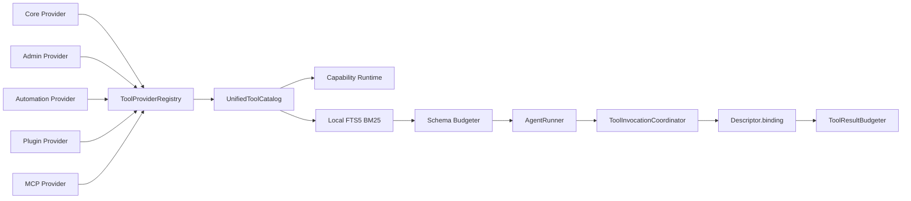

# Tool Kernel

Yuki 2.1 把工具来源和执行方式分开。`ToolProvider` 只贡献
`CapabilityDescriptor`，`ToolBinding` 才持有可执行实现；Capability Runtime 和 AgentRunner
不知道工具来自 Python 服务、插件、MCP Session，还是未来的 RPC 进程。

目录项包含 descriptor、provider、namespace、简述、tags、可检索文本、Schema Token 估算、可用性和
revision。模型工具名全局去重；远程 MCP 名称规范为 `mcp__<server>__<tool>`。

`CapabilityDescriptor` 可同时属于多个 namespace，并通过 `CapabilityExposure` 区分本轮检索命中
的能力与真实用户轮固定保留的能力。Tool Bundle 是带必需成员的普通 namespace：本地检索不能拆散
已选 Bundle；完整 Schema 超预算时由 Budgeter 明确拒绝。没有 Flash 精排。
Schema Token 统一按工具名、描述、参数和 function-calling 外层估算。

当候选选择或 Schema 预算省略了后续真正需要的工具时，Agent 可调用小型
`request_tools` 网关，以自然语言描述能力。Host 只在当前真实事件经过权限、来源、只读模式、
图片与联网隔离后仍可用的统一目录中匹配；匹配项会在下一次模型请求中以完整原始 Schema
加载，再由 Agent 正常调用。网关只改变本轮暴露集合，不代替目标工具执行，也不授予新权限。

同一模型响应里的连续 `parallel_safe` 工具可并发执行。修改状态、平台修改、非幂等或语义未知的
工具默认串行；工具结果始终按模型原始 call 顺序回传。调用总数只取运行时
`agent.max_tool_calls`、`agent.max_model_requests` 和 `tooling.max_parallel_calls`。

Core、Admin、Automation 和 Plugin 通过 `InProcessToolBinding` 兼容现有服务；MCP 使用
`MCPToolBinding`。未来只需实现 `RpcToolBinding` 和新的 Provider，无需修改 Capability Runtime
或 AgentRunner。

Provider 可返回 `mutation_committed=True/False/None`；统一解析器先尊重失败与显式值，再按
Descriptor effect 推断。结果预算器会在裁剪时优先投影 URL、ID、状态和错误，完整结果仍可写入
有期限的 Artifact。
