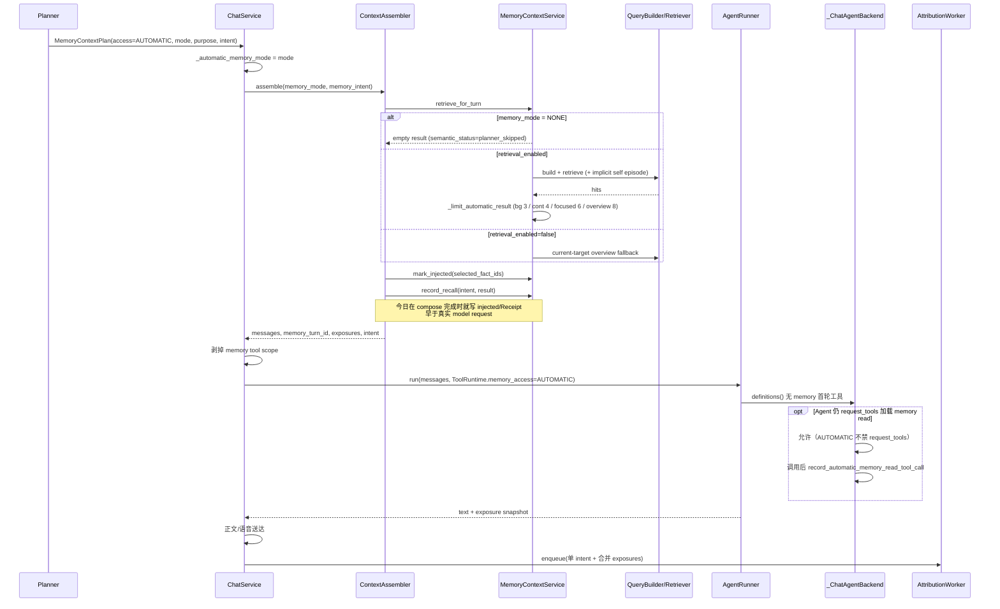
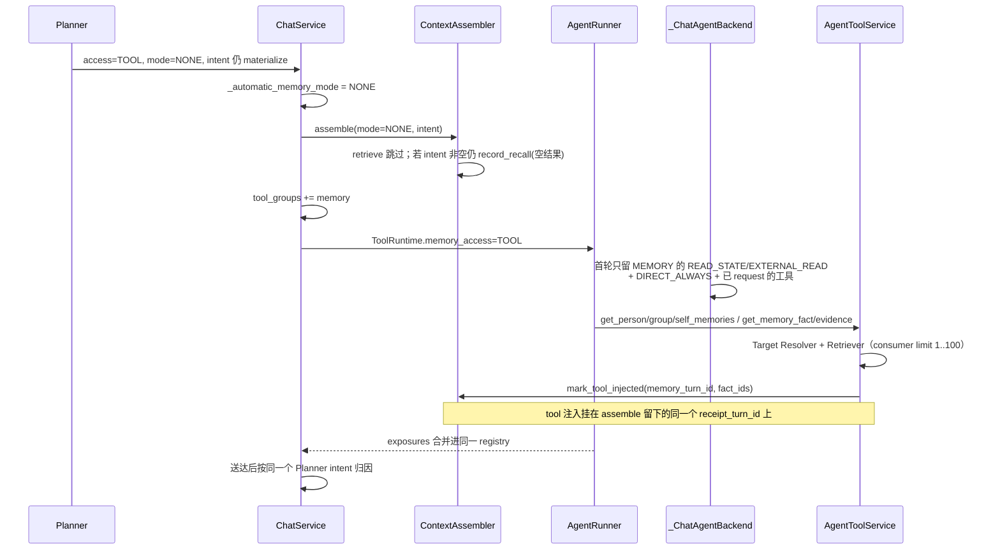
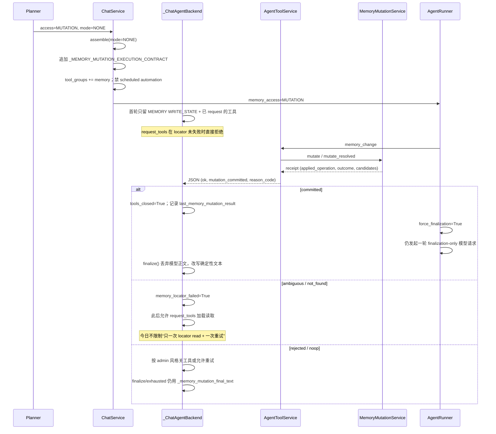
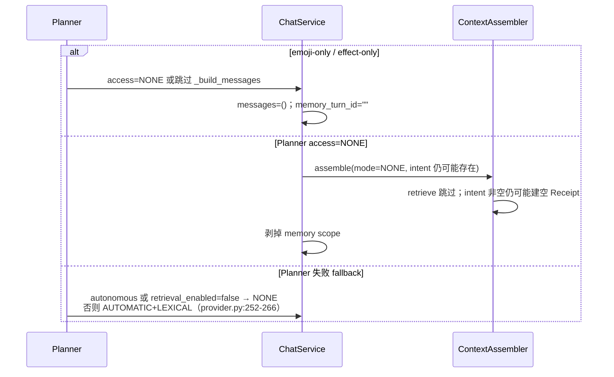

# R2 开工前代码审阅结论（r2-code-review-findings）

> 基线：当前分支 `codex/refactor-3.6-runtime`（R1 已合入；产品版本仍为 Yuki `3.5.3`，Alembic head `0037`）。
> 对照任务书：`02-R2-MEMORY-RUNTIME.md`，已按 `main@2695484` 与本分支实码核对。
> 审阅范围：任务书第 2 节列出的文件，外加 `planner/models.py`、`planner/provider.py`、
> `planner/service.py`、`services/processor.py`、`services/agent_runner.py`、
> `memory/metrics.py`、`memory/quality/contracts.py`、`config/memory_contracts.toml`。

R1 已冻结 `MemoryTurnContract` 组合规则、`MemoryCapabilityView` 投影和
`MemoryTurnSession` Protocol，但生产编排仍全部在 `ChatService` /
`_ChatAgentBackend`。本轮必须先画清四条现路径，再把它们搬进独立 Session。

---

## 1. 术语对照（实现期不得混用）

| 名字 | 3.5.3 真实含义 | R2 新含义 | 禁止 |
|---|---|---|---|
| `MemoryContextMode` (`none/lexical/hybrid/overview`) | 检索模式 | 仍是检索模式；overview 只留给 Active Read | 不得改成注入策略 |
| `MemoryRecallPurpose` (`background/continuation/recall/verify/correct`) | Planner 选择的召回用途；非 bg/cont 走 focused 预算 6 | 保留枚举；passive 只允许 background/continuation | 不得把 focused 当成 purpose |
| focused | `_limit_automatic_result` 的预算桶（purpose ∉ {bg, cont} 且非 overview） | Active Read 默认相关检索预算 6 | 不得变成 Context Policy |
| `MemoryAccessMode` (`none/automatic/tool/mutation`) | Planner 首轮路径，Chat 全路径分支键 | **删除，不留 alias** | 不得在新代码里按此分支 |
| `MemoryContextPolicy` (`none/background/continuation`) | 不存在 | 自动注入策略 | 不得顶替 mode/purpose |
| `memory_turn_id` / `memory_recall_receipts.turn_id` | Receipt 级 uuid（一次 recall 一个） | 继续叫 `receipt_turn_id`；整轮用 R1 的 `runtime_turn_id` | 不得把旧列改义 |

`query.py:94-99` 把当前消息与 `inbound.reply_text[:500]` 拼进 FTS；这就是任务书说的
「最多 500 字可信 reply excerpt」。最近历史窗口不进入 query。

---

## 2. 当前四条路径时序图

Planner 用 discriminated union 选出四条互斥 access
（`planner/models.py:509-547`）。`ChatService.respond` 读
`planned_turn.plan.memory_context.access`；无 Planner 时默认
`MemoryAccessMode.AUTOMATIC`（`chat.py:2034-2038`）。

首轮 Memory scope 由 `_initial_scopes_for_memory_access` 决定：
`TOOL`/`MUTATION` 强制加入 `memory`，其余路径剥掉 `memory` 及其子 scope
（`chat.py:182-194`）。Automatic 检索模式由 `_automatic_memory_mode` 门控：
只有 `AUTOMATIC` 才把 Planner 的 mode 传给 assembler，否则 `NONE`
（`chat.py:197-201, 2723-2728`）。

### 2.1 Path A — AUTOMATIC（被动注入）

关键落点：

- 预算：`memory/context.py:277-293`。overview 用 `automatic_recall_overview_limit`，
  且 `requested_count` 存在时 `min(limit, requested_count+2)`。
- 隐式 SELF episode：`retrieve_for_turn` 在 RELEVANT + self_enabled + 未显式
  `self_recall` 时合并最多 1 条（`context.py:234-246, 349-392`）。
- `record_recall` 在 `intent is None` 时直接返回 `None`（`context.py:464-465`）。
  Planner 缺失时 `_build_messages` 传 `memory_intent=None`（`chat.py:2734-2738`），
  因此 **无 Planner 的 AUTOMATIC 仍会 retrieve + mark_injected，但不建 Receipt**。
- Attribution 条件：`usage_attribution_enabled`、有 `memory_turn_id`、有
  `memory_intent`、非 fallback、origin ∈ {USER_MESSAGE, AUTONOMOUS_GROUP}、
  有正文、有 exposures（`chat.py:2671-2682`）。Job 只带 **一个** intent
  （`attribution.py:121-130`）。

### 2.2 Path B — TOOL（主动读取）

关键落点：

- TOOL 首轮过滤：`chat.py:526-549`。`DIRECT_ALWAYS`（如 `request_tools`）保留。
- `get_person_memories` / `get_group_memories` / `get_self_memories` 已有独立
  target/visibility（`agent_tools.py:304-407`）。`get_group_memories` schema
  仍要求模型填 `group_id`（`agent_tools.py:351-357`）——R2 Query Plane 必须继续
  忽略模型身份字段，改由 Resolver 决定。
- 现有 tool 参数是 `query/mode(relevant|overview)/limit`，**没有** purpose /
  entities / ISO range / preferred_kinds。R2 §6.2 要在这三个检索 Tool 上增加
  可选结构化 intent，缺省保持 neutral ordering。
- `mark_tool_injected` 复用 `runtime.memory_turn_id`（`agent_tools.py:1890`）。
  若 AUTOMATIC 未建 Receipt（intent=None），tool 路径的 `turn_id` 可能是空串。

### 2.3 Path C — MUTATION（独占写入）

关键落点：

- 状态全是 `_ChatAgentBackend` 实例字段：`_memory_locator_failed`、
  `_memory_mutation_attempted`、`_last_memory_mutation_result`（`chat.py:426-428`）。
- `request_tools` 在 MUTATION 且 locator 未失败时返回 `capability_not_loaded`
  （`chat.py:822-834`）。失败后不再限制读次数或是否同批 side effect。
- 提交后 `finalize_after_commit=True`（`chat.py:977-986`）让
  `AgentRunner` 再打一轮「不得调用工具」的模型请求（`agent_runner.py:210-231, 615-616`），
  然后 `finalize()` **丢弃**该正文（`chat.py:1111-1113`）。这正是 R2 要删的
  discarded final model call。
- 确定性正文已存在且按 receipt 字段分支（`chat.py:1191-1254`）：ambiguous /
  not_found / rejected / noop / contested / deduplicated / 各 applied_operation。
  迁入 `MemoryFinalizer` 时应原样搬迁这些句子，避免回复口径漂移。
- 同批 side-effect preflight **不存在**。MUTATION 首轮靠 scope 过滤降低风险，
  但 `request_tools` 之后或 TOOL 路径仍可能把 `memory_change` 与 web/admin
  放进同一 batch。R2 要求执行前 preflight。

### 2.4 Path D — NONE / 禁记忆

`deterministic_effect_plan` / emoji exclusive 会把 memory 打成 NONE
（`planner/provider.py:197-201`，`planner/service.py:306-314`）。
`FORBIDDEN` 作为合同形状在 R1 已有，但 3.5.3 **没有**对等的运行时枚举——
禁记忆是 Planner `NONE` + 剥 scope，不是 `availability=FORBIDDEN`。

---

## 3. 任务书核对与必须记录的语义偏差

### D1 图片轮写入是收紧，不是保持现状

`processor.py:551-565, 663-687` 的 `image_write_isolated` **只**拦截带图的
显式写命令（direct plugin / `commands.may_write`）。`memory_change` 与 Planner
`MUTATION` 不看图片。Capability policy 把 `contains_images` 传给工具可见性，
但未按图片硬关 memory write。

R2 决议：图片轮 `write_transition=DENIED`（context 仍可读）。必须进回放对比
与 3.6.0 release note，不得写成“保持 3.5.3”。

### D2 Prompt 构造完成 ≠ exposure

`ContextAssembler.assemble` 在 `compose` 之前就 `mark_injected` +
`record_recall`（`context_assembler.py:288-298`）。模型未启动、被 supersede、
或 prompt 构造失败后仍可能留下 injected/Receipt。

R2 必须把副作用挪到 `confirm_prompt_exposure(token, payload_fact_ids)`，且仅
AUTOMATIC_CONTEXT / AGENT_TOOL 在 payload 实际进入 Main Agent 请求后调用。
回归：prompt/model start 失败不得产生 injected。

### D3 单 intent / 单 receipt_turn_id 无法表达多次 read

`ToolRuntime` 只有一个 `memory_turn_id`、一个 `memory_intent`、一份
`memory_exposures`（`agent_tools.py:125-129`）。Attribution job 同样只有一个
intent（`attribution.py:127`）。Automatic + 后续 tool read 会串 purpose/alpha。

R2 用 `RecallLedger`：每次 automatic/tool read 独立 `RecallHandle`。归因按
handle 分组。这是结构变化，不是兼容 alias。

### D4 `requested_count` 仍在 `MemoryQueryIntent`（合同 v5）

`memory/models.py:431`，`config/memory_contracts.toml` 的
`memory_query_schema = 5`。automatic overview 用 `requested_count+2` 截断
（`context.py:286-287`）。

R2 把它移到 `MemoryReadRequest.requested_limit`，合同 5→6，更新 frozen
snapshot；Plugin Memory Facade 1.0 方法与返回结构不变。

### D5 Mutation 仍会打一轮被丢弃的 final model

见 §2.3。`force_finalization` 会加系统提示并再请求一次模型
（`agent_runner.py:213-231`），`finalize()` 再覆盖正文。R2 终端 mutation
必须由 Finalizer 直接结束 Agent loop，不再发这次请求。这是可观测的模型调用
次数变化，需写入回放对比。

### D6 Locator 重试无上界

今日 `memory_locator_failed` 是布尔值，失败后开放 `request_tools`，不限制
一次有界 read + 一次 mutation 重试。R2 状态机必须硬限制；超出则确定性收束。

### D7 无 mutation 同批 side-effect preflight

见 §2.3。R2 要求 batch 执行前：只要含 memory write，拒绝批内所有其他
side-effect，与模型给出的顺序无关。

### D8 `retrieval_enabled=false` ≠ forbidden

`retrieve_for_turn` 在引擎关闭时对合法 current targets 做 overview fallback
（`context.py:252-274`）。Planner fallback 在 `retrieval_enabled=false` 时选
`NONE`（`provider.py:256-263`），与引擎 fallback 不是同一条路。R2 resolver
必须区分：availability 仍 ENABLED，context/read 按 origin 决定，检索降级留在
Query Plane。

### D9 Plugin/Admin 今日已是另一套入口，但副作用边界要写死

`MemoryContextService.search`（`context.py:420-436`）是纯 retrieve，不写
Receipt。Plugin facade / Admin 走这条或 `for_targets` + neutral ordering。
R2 Query Plane 必须保持：Plugin/Admin 永不 `publish_exposure()`。

### D10 Reinforcement 仍是“used 事务 + 后续 mark_reinforced 事务”

`reinforce_usage` 先 `activation.reinforce`，再 `receipts.mark_reinforced`
（`context.py:559-566`）。R2 要求新增 `AttributionCommitter`，单 fact 的
claim / recheck / Activation CAS / item reinforced / header `reinforced_count`
同事务。这是崩溃一致性收紧，需故障注入测试。

### D11 Receipt `candidate_count` 列义保持 source-candidate 次数

不得为 unique count 加列。R2 只加进程指标 `candidate_unique_count`。测试不得
断言 candidate/selected/item 三者相等。

### D12 无 Planner 时的 AUTOMATIC 默认

`planned_turn is None` → access=AUTOMATIC、mode=LEXICAL、intent=None
（`chat.py:2037, 2729, 2734-2738`）。R2 不再有 Planner，resolver 对普通
自然语言输出 passive（background/continuation），intent 由 Runtime 生成，
因此 **无 Planner 路径会开始有 Receipt**（若 prefetch 真正进入模型）。这是
可观测变化，记入回放。

### D13 focused/overview 从 automatic 注入消失

3.5.3 Planner 可把 AUTOMATIC + HYBRID/OVERVIEW + purpose=recall/verify 变成
focused 6 / overview 8 的自动注入。R2 锁定：passive 只产生中性 background /
可信 continuation；focused/overview 仅 Active Read 工具可选。这是已锁定的
行为变化，必须有回归：同样的“你还记得…”句子不再自动注入 6/8 条。

---

## 4. 从 ChatService 必须搬走的所有权

任务书 §9 清单与实码一一对应，全部在 `services/chat.py`：

| 符号 | 行号（约） | 迁入 |
|---|---|---|
| `_initial_scopes_for_memory_access` | 182 | Capability view / session |
| `_automatic_memory_mode` | 197 | Session.prefetch 门控 |
| `_with_memory_mutation_contract` | 204 | Session exclusive_write 规则片段 |
| `memory_access` 分支 | 445–1168, 2034–2189 | 合同字段 / AccessPhase |
| `_memory_locator_failed` | 426, 825, 886, 1095 | Locator status |
| `_memory_mutation_attempted` / `_last_memory_mutation_result` | 427-428, 1055-1062 | MutationState + last receipt |
| `_memory_mutation_final_text` | 1191 | MemoryFinalizer |
| `post_commit_recovery_text` 的 mutation 分支 | 1142-1149 | Finalizer |
| `_record_memory_mutation_turn_outcome` | 1944, 1999, 1057 | memory.runtime.observability |
| `_enqueue_memory_attribution` | 2662 | Session.on_delivery_confirmed |
| assemble 期 exposure/receipt | context_assembler 288-353 | confirm_prompt_exposure |

Chat 最终只准调用：`prefetch` / `capability_view` / `observe_tool_result` /
`finalize_text` / `on_delivery_confirmed`。

`AgentToolService._memory_change` 继续把参数变成 `MemoryMutationRequest`；
durable 事务仍只在 `MemoryMutationService`。

---

## 5. R2 实现决策（本轮遵守）

1. **单 owner 切换**：Runtime 接管生产编排的同一提交里，从 Planner prompt /
   schema / `TurnPlan` 消费端删除 memory access/intent。不保留双轨。
2. **Profile 只是工厂**：`dormant/passive/active_read/exclusive_write/forbidden`
   不得成为可检查枚举；业务只读合同字段与 Session 状态。
3. **不引入 Memory Router LLM**，不编译“记住/忘掉/你还记得”词典。
4. **Query 内核纯读**；Receipt/Activation 只在真实 model payload exposure 后写。
5. **图片写隔离按收紧实现**，并在观测里用独立 resolver reason。
6. **0037 不再扩表**：mutation/tool receipt 的 `runtime_turn_id` 仅在 R2 观测
   需要时再加；不顺手改 `agent_actions` / speech / web_search。
7. **Capability view 在 locator 阶段放开只读 namespace**：默认 exclusive 仍只
   曝光 `memory.state.write`；`read_policy=LOCATOR_ONLY` 时才把 read
   namespaces 放进 eager。这是 Session 内部 escalation，不是新 profile。

---

## 6. 建议提交落地（相对任务书 §14）

任务书把 findings 放在最后一提交。本文件是开工前置产物，先于代码提交写入
工作区；正式 `docs(refactor): record R2 code review findings` 仍可按 §14
在四路径回归套件之后再提交，避免文档与尚未存在的实现互相引用。

Commit 1 范围（本轮立即做）：`errors.py`、`state.py`、合同 profile 工厂与
合法合同转换、Session 状态容器（ledger / locator / attribution handoff），
**不**接入 `ChatService`。
